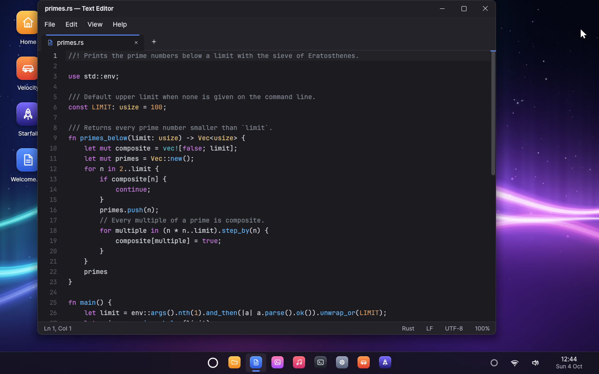
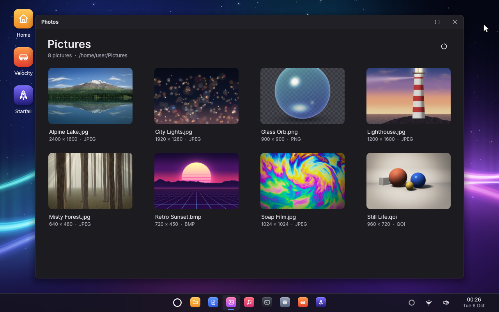

# Veda: The Agentic-Native Operating System

Veda is an operating system with an AI agent built into it — not an
assistant added to a desktop, but a part of the system that every
application is made to work with. You talk to it the way you would talk
to someone in the room — "Hey Veda, switch my wallpaper to the dunes" —
and it does the work through the same operations as your keyboard and
mouse, in any application, and asks you before anything that is hard
to undo.

Everything is written from scratch in Rust and lives in this repository:
the UEFI bootloader, a capability-based microkernel, the drivers, the
system services, the window system, the toolkit and the applications. A
few mature crates provide the TCP/IP engine, TLS and cryptography
(smoltcp, rustls, RustCrypto). Veda runs on x86-64 PCs, in QEMU and
VirtualBox.


## Why agentic-native

Operating systems were designed for a person at a keyboard. An assistant
added to one later usually has to read the screen, imitate clicks or make
do with the few applications that offer an API, and the system has no say
in what it does. Veda turns this around: the agent is a first-class user
of the system, and the system is built so that its work is reliable,
visible and safe.

* **The agent is part of the system.** It is a system service, started at
  boot and restarted if it fails, present as a small ring on the taskbar
  and asleep until you call it — by its name, with a click on the ring or
  with **Super+Space**.
* **Every application speaks to it natively.** Agent support is part of
  the application platform: an application describes its actions, with
  typed parameters and a risk level, reports what it shows as structured
  state, and carries out actions through the same code as the keyboard and
  mouse — so the window shows the result exactly as if you had done it. No
  screen scraping, no simulated clicks. The built-in applications offer
  more than 70 actions between them, from writing in a document to
  starting a race.
* **The system holds the agent to your consent.** Every action is
  *routine*, *sensitive* or *destructive*. Routine actions just happen; the
  others wait for your OK. The agent service enforces this, not the
  language model: the call is held until you answer, only the desktop
  shell can answer (the system knows each program by the identity `init`
  attaches to its connections), and nothing the agent reads in a document
  or an application can approve anything.
* **It works from real context.** Every conversation starts with what the
  agent needs to help: the time, the windows on the screen, every
  application's actions, what you have told it about yourself and how your
  last conversation ended. While it works it reads the applications'
  state, so it acts on what is really there.
* **Your memory stays yours.** It remembers what you tell it plainly —
  your name, the people in your life, how you like things done — never its
  own guesses. That memory is kept on your computer, and Settings shows all
  of it and forgets any of it.
* **Voice comes first.** Conversations happen in real time: interrupt the
  agent and it stops and listens. The audio system is built for it — echo
  cancellation and an echo gate so that the agent never hears itself, and
  other sound turned down while it talks with you. While it sleeps, a voice
  detector on the computer listens for speech, so that nothing leaves the
  computer while nobody speaks.
* **The intelligence is a setting.** Speech recognition, the language
  model and the voice come from Deepgram's Voice Agent platform, with the
  audio opted out of Deepgram's model improvement; the model, the voice
  and even the agent's name are chosen in Settings.

## How the agent works

```
 ┌───────────────────────────────────────────────────────────────────────┐
 │ You: voice, keyboard, mouse                                           │
 ├───────────────────────────────────┬───────────────────────────────────┤
 │ Agent service                     │ Desktop shell                     │
 │  conversation (Deepgram Voice     │  the ring and the agent's window  │
 │  Agent) · name listener · memory  │  consent requests · notifications │
 │  worker: functions and consent    │                                   │
 ├───────────────────────────────────┴───────────────────────────────────┤
 │ Applications: actions · state · invoke (the agentapp protocol)        │
 ├───────────────────────────────────────────────────────────────────────┤
 │ Services: windows · files · audio · network · Wi-Fi · launcher        │
 ├───────────────────────────────────────────────────────────────────────┤
 │ vkernel: capabilities · IPC · isolation · scheduling                  │
 └───────────────────────────────────────────────────────────────────────┘
```

1. **Listening.** Asleep, the agent runs a voice detector on the computer.
   When someone speaks, the speech goes to a recogniser that knows the
   agent's name; a sentence that calls it ("Hey Veda, …", "…, Veda?") wakes
   it, and what was said with the name is the first thing it hears.
2. **Conversation.** Waking opens a Deepgram Voice Agent session with the
   agent's instructions, the context above and its functions. Deepgram
   takes care of turn-taking, the language model and the voice; Veda's
   audio service carries the sound both ways.
3. **Action.** The model calls the agent's own functions — windows, files,
   volume, Wi-Fi, wallpaper, notifications, timers and reminders, memory,
   the system and its running programs — and, through `use_app` and
   `read_app`, every application's actions and state. The agent service
   runs each call and answers with a structured result.
4. **Consent.** A call that needs your OK is held and shown in the agent's
   window (or as a notification while the window is closed), saying
   exactly what will happen and to what. Allow it and it runs; decline it,
   or let it expire, and it does not. Sensitive actions can be allowed for
   good; destructive ones are asked about every time.

[The agent](docs/AGENT.md) describes the design in full: the protocols,
the voice pipeline, consent, memory and how the agent is tested.

## The operating system

* **Microkernel.** `vkernel` only does isolation, scheduling, memory and
  IPC: capability handles with rights, channels that carry handles, VMOs,
  events, futexes, interrupt objects. SMP with x2APIC, tickless timers and
  XSAVE. Drivers, the file system, the window system and the agent are
  user-space processes, supervised by `init`: if the window system
  crashes, it is restarted and the desktop comes back on its own.
* **Desktop.** A startup sequence that carries the boot splash on without
  a seam (a breathing light around the ring, the name and tagline rising
  in, a startup sound) and dissolves it into the desktop once that is
  ready; a compositing window manager with server-side decorations,
  shadows, animations, window snapping and an Alt+Tab switcher with live
  thumbnails; a shell with wallpaper, desktop icons, a taskbar, a
  searchable start menu, a calendar and notifications; the `vui` toolkit
  (widgets, menus, dialogs, vector icons, anti-aliased text with the Inter
  and JetBrains Mono fonts), whose applications are agent-compatible.
* **Networking and Wi-Fi.** A user-space network service (IPv4 and IPv6,
  DHCP, DNS, routing, TCP, UDP, ICMP) and a Wi-Fi service that scans,
  joins WPA2, WPA3 and open networks with management frame protection,
  remembers networks, reconnects and roams on its own. Drivers only move
  frames. Applications, the agent among them, get TLS 1.3 and 1.2 (HTTPS,
  secure WebSockets) from `vtls`, with certificates checked against the
  Mozilla roots. Under QEMU a simulated Wi-Fi environment provides access
  points bridged to the Internet. See [Networking](docs/NETWORKING.md).
* **Audio.** A mixing audio service with echo-cancelled capture and
  ducking, built for the agent's conversations as much as for music.
* **Storage.** virtio-blk and AHCI (SATA) drivers and a file system
  service that keeps the home directory on its own disk with crash-safe
  snapshots, so your files survive restarts. The agent's memory and key
  live in a private directory that only the agent can open.
* **Applications.** Text Editor, Photos, Music, Files, Terminal, Task
  Manager, Settings and About, and two 3D games, *Velocity* (racing) and
  *Starfall* (a space shooter), rendered by the `v3d` software 3D engine.
* **3D graphics.** OpenGL ES 3.0 with GLSL ES 1.00 and 3.00 (`vgl`,
  `vglsl`), every call checked as the specification requires. It renders
  on the host's GPU through QEMU's 3D virtio-gpu, or with a multi-threaded
  software renderer where there is none. *Prism* shows it off: a
  reflective knot, shadow-mapped crystals drawn with instancing, and a
  fountain of sparks simulated with transform feedback, at 55 frames a
  second under QEMU.
* **C, and GCC inside Veda.** Write a C program in the Terminal or the
  Text Editor, compile it with GCC 16 and run it, in an emulator or on a
  PC alike. C programs are static ELF executables on the musl C library,
  whose system calls go to `vposix`, a POSIX layer written in Rust: files,
  directories, pipes, a terminal with line editing and `termios`, threads,
  `mmap`, `posix_spawn`, clocks and signals they raise themselves. The
  toolchain is built from the upstream releases with small patches
  (`ports/`), and a cross compiler builds C and C++ programs for Veda on
  the development machine. See [C on Veda](docs/C.md).
* **Tooling.** One command builds a bootable disk image and runs it in
  QEMU or VirtualBox; scripted, headless runs drive the GUI and the agent
  and check screenshots and logs.

## Screenshots

|  |  |
|:---:|:---:|
| Text Editor | Photos |
|  |  |
| Music | Files |
|  |  |
| *Velocity* | *Starfall* |

All screenshots are taken in QEMU by `cargo xtask script docs/screenshots.vts`
(the agent talking to the stand-in for Deepgram).
Veda also runs in VirtualBox (see below).

## Quick start

### Requirements

* Windows 10 or 11, x64. (User-space programs are PE executables linked by
  the Microsoft linker.)
* [Rust](https://rustup.rs) (stable). `rust-toolchain.toml` makes rustup
  install the extra `x86_64-unknown-uefi` target on first use.
* The Microsoft linker that Rust uses on Windows: Visual Studio 2022 or the
  Visual Studio Build Tools with the MSVC build tools (`link.exe`). The
  Rust installer offers to set these up.
* [QEMU](https://www.qemu.org/download/#windows) for Windows, which includes
  the OVMF UEFI firmware, and/or [VirtualBox](https://www.virtualbox.org/)
  7.1 or newer (no Extension Pack needed).
* For the agent: a [Deepgram](https://deepgram.com) API key, entered in
  Veda's Settings.
* For C and GCC in the image (optional): [MSYS2](https://www.msys2.org)
  with a few packages, to build the toolchain once with
  `cargo xtask toolchain` (see [C on Veda](docs/C.md#the-toolchain)).

Check the environment:

```bash
cargo xtask doctor
```

### Build and run

```bash
cargo xtask run
```

This builds every component, writes the disk image
`target/veda/veda.img` and boots it in a QEMU window. The first build
takes one to two minutes on a recent PC (it also renders the sample pictures
and music); later builds are incremental. Useful options:

```bash
cargo xtask run --resolution 1920x1080 --smp 4 --memory 2048
cargo xtask run --cmdline "run=editor"
```

`--cmdline "run=NAME"` starts `/system/bin/NAME.exe` after boot. The
machine is on QEMU's NAT through a wired card by default; for Wi-Fi:

```bash
cargo xtask run --net wifi
```

This also starts `airsim`, a simulated Wi-Fi environment whose networks
("Veda Home", "Veda WPA3", ...; password `veda-wifi`) lead to the
Internet. `--net both` adds the wired card. See `cargo xtask help` for all
commands and options.

### VirtualBox

Every command takes `--vm virtualbox` to use VirtualBox instead of QEMU,
with the same options:

```bash
cargo xtask run --vm virtualbox
```

xtask creates (and on every run updates) a VirtualBox machine named
"Veda" whose disks are the same images QEMU uses, so builds need no
conversion and the home directory is shared between the two. VirtualBox
uses the CPU's hardware virtualization (QEMU on Windows emulates the CPU
in software). The machine is closer to a real PC: SATA disks, an Intel
PRO/1000 network card, PS/2 keyboard and mouse, AC'97 sound with the
host's speakers and microphone (Windows must allow VirtualBox to use the
microphone, in Settings → Privacy). Click into the window to use the mouse; the right
**Ctrl** key releases it.

On a high-DPI display the window enlarges the screen as QEMU's does, by the
whole part of the display scaling (2x at 250%), or less if the window
would not fit on the screen. `--scale` sets the factor (`--scale 2.5`
matches other programs at 250%; whole numbers look sharpest) and
`--resolution` gives Veda a larger desktop:

```bash
cargo xtask run --vm virtualbox --resolution 1600x1000 --scale 2
```

To put Veda on your real network (your router's DHCP and DNS, the real
Internet) through the host's network adapter, Wi-Fi included:

```bash
cargo xtask run --vm virtualbox --net bridged
```

`shot`, `script` and `test` work with `--vm virtualbox` too; scripts that
need QEMU (the simulated Wi-Fi) are skipped.

### A real PC, from a USB stick

```bash
cargo xtask iso
```

writes `target/veda/veda.iso`, a live system. Write it to a USB stick with
[Rufus](https://rufus.ie) (partition scheme GPT, target system UEFI, ISO
mode), or as it is with any image writer, and start the PC from the stick
(usually from the firmware's boot menu: F12, F11 or Esc at power-on) in
UEFI mode with Secure Boot off, as Veda's loader is not signed. Veda runs
from memory and leaves the PC alone: no disk driver starts, so it never
reads or writes the PC's disks or the systems installed on them, and its
home directory lasts until the PC is turned off. To try the stick in QEMU
first:

```bash
cargo xtask run --live
```

On real hardware the desktop appears in the screen mode the firmware
provides (1920x1080, or the largest below it). USB keyboards, mice and
hubs work on the USB 3 (xHCI) controllers that PCs have had since about
2012, as do PS/2 keyboards and mice; other USB devices, the stick
included, are left alone. Sound plays on HD Audio, the sound hardware of
nearly every PC since 2005: through the speakers, or the headphones when
they are plugged in, and the line outputs, with the microphone (built in,
or on a jack when one is plugged in) for the agent. Built-in microphones
wired to an audio DSP rather than to the codec, as in many recent
laptops, stay silent; HDMI and DisplayPort audio need a graphics driver,
which Veda does not have yet; and few PCs have network hardware Veda
supports. To try USB input or HD Audio in QEMU:

```bash
cargo xtask run --input usb
cargo xtask run --sound hda
```

## Talking to Veda

1. Open **Settings → Agent** and add your Deepgram API key. The agent's
   name, voice, language model, listening and memory are on the same page.
2. Say **"Hey Veda"**, click the small ring at the right of the taskbar or
   press **Super+Space**.
3. Talk naturally, ask follow-up questions, interrupt whenever you like,
   and say goodbye when you are done. It goes back to sleep and listens
   for its name.

Veda hears you through your PC's microphone and answers through its
speakers, under QEMU and VirtualBox alike.

Things to ask:

* "Switch my wallpaper to the dunes."
* "Play Neon Horizon."
* "Write a shopping list with eggs, milk and coffee."
* "Show me the lighthouse photo, full screen."
* "Remind me to stretch in twenty minutes."
* "What's using the most memory?"
* "Start a race in Velocity."
* "Delete the City Lights photo" — and see it ask you first.
* "What do you know about me?"

## Using the desktop

* Click the logo (the ring in the middle of the taskbar) or tap the
  **Super** key for the start menu; type to search for an application.
* Click a taskbar button to open, focus or minimise an application;
  middle-click opens another window. Click the clock for the calendar.
* Double-click desktop icons. Right-click the desktop to change the
  wallpaper.
* Drag a window to the top of the screen to maximise it, or to a side to
  fill that half (or use **Super+Left/Right/Up/Down**). **Super+D** shows
  the desktop, **Alt+Tab** switches windows and **Alt+F4** closes the
  active one.
* The speaker icon on the taskbar opens the volume control (scroll over it
  to change the volume). The network icon next to it shows the Wi-Fi
  signal and opens the list of networks to join.

Your files live in `/home/user`, kept on `target/veda/home.img` across
restarts and rebuilds (`--fresh-home` starts over).

## Applications

Every application is agent-compatible: what you can do with the mouse and
keyboard, the agent can do too, through the application's own actions.

| Application | What it does | What the agent can do |
|-------------|--------------|-----------------------|
| **Text Editor** | Tabs, syntax highlighting (Rust, C, TOML, Markdown), find and replace, word wrap, line numbers, zoom, unlimited undo, open/save dialogs. | Create, open, read and write documents; find and replace, select, undo, save; save under another name or discard changes (with your OK). |
| **Photos** | A thumbnail library of `~/Pictures` and a viewer with zoom, pan, rotation, full screen, slideshows, details and "set as wallpaper"; PNG, JPEG (including progressive), BMP and QOI. | Show any picture, zoom, rotate, go full screen, run a slideshow, show details, set a picture as the wallpaper. |
| **Music** | A library of `~/Music`, now playing with cover art and a live spectrum visualiser, seeking, shuffle and repeat; plays QOA and WAV through the audio service. | Play a song by its name, pause, stop, skip, seek, shuffle, repeat, set the volume. |
| **Files** | Places sidebar, breadcrumbs, list and icon views with thumbnails, search, copy/cut/paste, rename, delete, new folders and documents, properties, free space. | Open folders and files, search, show properties, make folders; copy, move and rename (with your OK); delete (asked every time). |
| **Terminal** | A command shell with about fifty built-in commands for files, processes, the network (`wifi`, `ifconfig`, `ping`, `nslookup`, `curl`, ...) and the system, history and tab completion. Runs programs, C programs and GCC included, as a Unix terminal does: line editing, `termios`, Ctrl+C, pipes and redirections. | Run a command (with your OK), read its output, interrupt it. |
| **Task Manager** | Processes with CPU and memory use, "end task", and live performance graphs. | List processes, show and read the performance graphs, end a program (asked every time). |
| **Settings** | Wallpaper gallery, the agent (Deepgram key, name, voice, language and speech models, listening, memory, permissions), network and Wi-Fi (connection, networks in range, saved networks, interfaces, diagnostics), display information and system details. | Open a page, change the agent's voice and speaking rate; rename the agent or change its language model (with your OK). Never the key. |
| **Velocity** | An arcade 3D racing game against computer opponents on a procedurally generated circuit. | Start, pause, resume or restart a race; change the track, laps or opponents. |
| **Starfall** | A 3D space shooter through asteroid fields and enemy waves. | Start, pause, resume or restart a game. |

The games are drawn by `v3d`, a multi-threaded fixed-point software 3D
renderer, and *Prism* by OpenGL ES. Beyond the applications, the agent's
own functions cover windows, files, sound, Wi-Fi, the wallpaper,
notifications, timers and reminders, its memory and the system.

## Building agent-compatible applications

Agent support is part of the `vui` application platform. An application
describes what it can do, reports what it shows and performs actions;
`vui::run` registers it with the agent service and answers the agent
between frames:

```rust
use vui::agent::{self, Action, AppAgentInfo, Risk, Value, arg_path, arg_str, object, show_path};

impl vui::App for Notes {
    fn update(&mut self, ui: &mut vui::Ui) { /* ... */ }

    fn agent_info(&self) -> Option<AppAgentInfo> {
        Some(agent::info(
            "A notes app: one note per file in ~/Notes.",
            vec![
                Action::new("add_line", "Adds a line at the end of the note shown")
                    .param("text", "string", "The line", true)
                    .build(),
                Action::new("delete_note", "Deletes a note for good")
                    .param("path", "string", "The note's file, such as ~/Notes/Ideas.txt", true)
                    .risk(Risk::Destructive)
                    .build(),
            ],
        ))
    }

    fn agent_state(&self) -> Value {
        object! { "note" => self.title.as_str(), "lines" => self.lines.len() }
    }

    fn agent_invoke(&mut self, action: &str, args: &Value) -> Result<Value, String> {
        match action {
            "add_line" => { self.append(arg_str(args, "text")?); Ok(object! { "lines" => self.lines.len() }) }
            "delete_note" => {
                let path = arg_path(args, "path")?;
                self.delete(&path).map_err(|e| format!("{} could not be deleted: {e}", show_path(&path)))?;
                Ok(object! { "deleted" => show_path(&path) })
            }
            other => Err(format!("Notes has no action called {other}")),
        }
    }
}
```

Actions are written for a language model (short imperative descriptions,
units and defaults spelled out), declare their risk, name their targets
explicitly and go through the same code as the keyboard and mouse. The
consent, the memory and the conversation are the system's job, not the
application's. See [Making an application agent-compatible](docs/AGENT.md#making-an-application-agent-compatible).

## Testing

```bash
cargo xtask test
```

runs the host unit tests of the libraries (the agent's protocol, tools,
prompt, memory, wake word and echo gate, the kernel ABI, heap, IPC,
service protocols, math, rasterizer, fonts, image codecs, 2D graphics,
text editing, paths and file types, audio, ELF loading, the POSIX layer,
build tool) and then boots Veda headless with the `systest` integration
tests (IPC, sockets, memory, threads, file system, launcher, crash reports,
recovery of the window system after it is killed, and C programs that
check the C library and the POSIX layer), failing on any panic.

The agent is tested end to end against a stand-in for Deepgram that runs
on the host (`tests/agent/`): conversations, function calls, interruptions,
echo, consent in the window and in notifications, waking by name over
music, every application's actions and restarts — deterministic, offline
and free. `tests/real/agent-*.vts` talk to the real Deepgram with the key
in `DEEPGRAM_API_KEY`, with a synthetic voice speaking into a virtual
microphone.

Networking has its own host tests (the 802.11 protocol and cryptography
against published test vectors, station against access point, TCP/IP stacks
over a simulated cable, the Wi-Fi simulator, TLS handshakes against a
rustls server and real certificate chains), and `nettest` checks DNS,
TCP, HTTP, HTTPS and ping from inside Veda.

GUI automation scripts in `tests/ui/` click through the desktop and
applications, check the log and save screenshots; two of them run C
programs in the Terminal and compile one with GCC inside Veda (they need
the toolchain, and are skipped without it). The Wi-Fi scripts join
networks through the desktop and break the simulated network in many ways
(access point gone, disconnection, outages, the radio or the Wi-Fi service
vanishing) to check that Veda recovers by itself. Run them all, the
agent's included, with the unit and integration tests, or one at a time:

```bash
cargo xtask test --ui
```

```bash
cargo xtask script tests/agent/wake-name.vts
```

```bash
cargo xtask shot --wait 20
```

(`shot` boots headless and saves `target/veda/screen.png`.)

The serial console (kernel log plus every program's output) is saved to
`target/veda/serial.log`.

## Repository layout

| Path | Contents |
|------|----------|
| `services/agent/` | the agent: conversations, the name listener, functions, consent, memory |
| `lib/agent/` | the agent's logic: Deepgram protocol, functions, instructions, wake word, echo gate, memory, configuration |
| `boot/` | `vboot`, the UEFI bootloader |
| `kernel/` | `vkernel`, the microkernel |
| `lib/` | shared libraries: `abi` (system call ABI), `rt` (runtime), `posix` (the POSIX layer under the C library), `elf` (ELF executables), `ipc` (message codec and protocol macros), `proto` (service protocols, the agent's included), `gfx`/`raster`/`font`/`image` (2D graphics), `ui` (toolkit and its agent support), `v3d` (3D engine), `glsl` and `gl` (the GLSL ES compiler and OpenGL ES 3.0), `net` and `tls` (networking and TLS for applications), `web` (HTTP and WebSocket), `json`, `audio` (mixing, echo cancellation, voice detection, synthesis), `usb` (descriptors, HID reports, xHCI structures), `hda` (HD Audio codecs and their routes), `text`, `math`, ... |
| `services/` | `init` (service registry, launcher, process identity), `vfs`, `devmgr` (PCI), `compositor`, `audio`, `agent`, `netd` (network), `wlan` (Wi-Fi) |
| `drivers/` | `ps2`, `virtio-input`, `xhci` (USB 3 controllers: hubs, keyboards, mice), `virtio-blk`, `ahci` (SATA), `hda` (Intel HD Audio), `virtio-snd`, `ac97` (AC'97 sound), `virtio-net`, `e1000` (Intel PRO/1000), `vwifi` (the virtual Wi-Fi radio), `virtio-gpu` (3D on the host's GPU) |
| `apps/` | the desktop `shell` (the agent's ring, window and consent requests) and the applications, including `racer` (*Velocity*) and `starfall` |
| `ports/` | the C toolchain built from source: GCC, binutils, GMP, MPFR, MPC and musl, each an upstream release and Veda's patch |
| `tests/` | the agent's scripts (`agent/`, and `real/` for the real services), `systest` and `nettest` (in-system tests), C and C++ test programs (`c/`), GUI automation scripts |
| `tools/` | host programs generating wallpapers, sample pictures and music at build time, and `airsim` (the simulated Wi-Fi environment) |
| `third_party/` | vendored crates with Veda patches (smoltcp) |
| `xtask/` | the build system: cross-compilation, disk image, QEMU and VirtualBox, automation, the stand-in for Deepgram |
| `assets/` | fonts, application manifests, and firmware for laptop speaker amplifiers |
| `docs/` | documentation, the README's screenshots, and the icon and social preview (`docs/icon/`) |

## Documentation

* [The agent](docs/AGENT.md): the voice agent, its functions, consent and
  memory, and how applications become agent-compatible.
* [Architecture](docs/ARCHITECTURE.md): how the system fits together.
* [Networking](docs/NETWORKING.md): the network and Wi-Fi services, the
  simulated Wi-Fi environment, security and tests.
* [C on Veda](docs/C.md): writing, compiling and running C programs, the
  POSIX layer, and how the toolchain is built.
* [Developing](docs/DEVELOPING.md): build commands, the system image,
  writing applications, performance notes.
* [Coding conventions](docs/CODING.md).

## License

Copyright © 2026 Vahid Mohammadi.

Veda is free software: you can redistribute it and/or modify it under the
terms of the GNU General Public License, version 3, as published by the
Free Software Foundation (see [LICENSE](LICENSE)). It is distributed in
the hope that it will be useful, but WITHOUT ANY WARRANTY; without even
the implied warranty of MERCHANTABILITY or FITNESS FOR A PARTICULAR
PURPOSE.

The bundled fonts (Inter, Lato, JetBrains Mono) are under the SIL Open
Font License 1.1; see `assets/fonts/`. The firmware in
`assets/firmware/cirrus/` is Cirrus Logic's, from the Linux firmware
collection: it runs on the speaker amplifiers' own DSP, not in Veda, and is
redistributed unmodified under Cirrus Logic's licence (`LICENSE.cirrus`
there), for use only with their devices. Vendored third-party code keeps
its own license; see `third_party/`. The C toolchain an image may contain
keeps its own licences too: GCC and binutils GPL version 3 or later (the
GCC runtime library with its Runtime Library Exception, so programs GCC
builds keep their own licences), GMP, MPFR and MPC LGPL version 3 or
later, musl MIT; their source is the upstream releases `ports/*/port.toml`
names, with the patches beside them.
