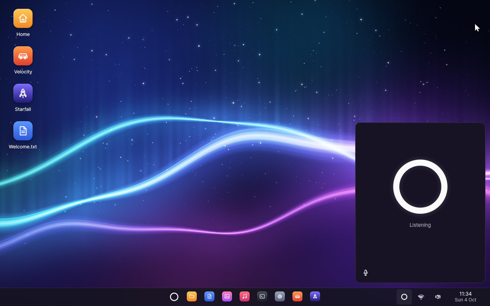
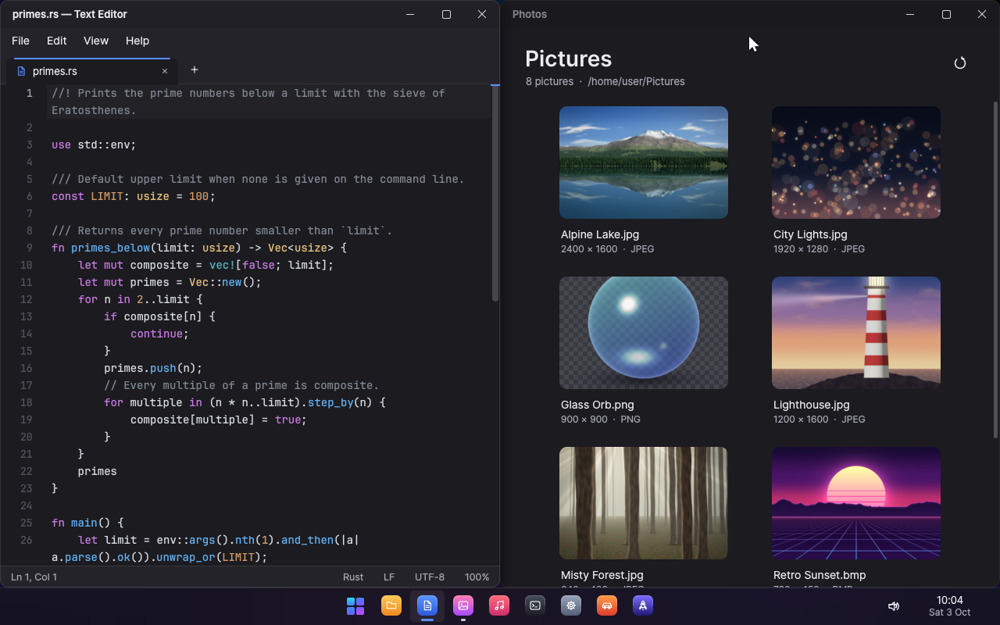
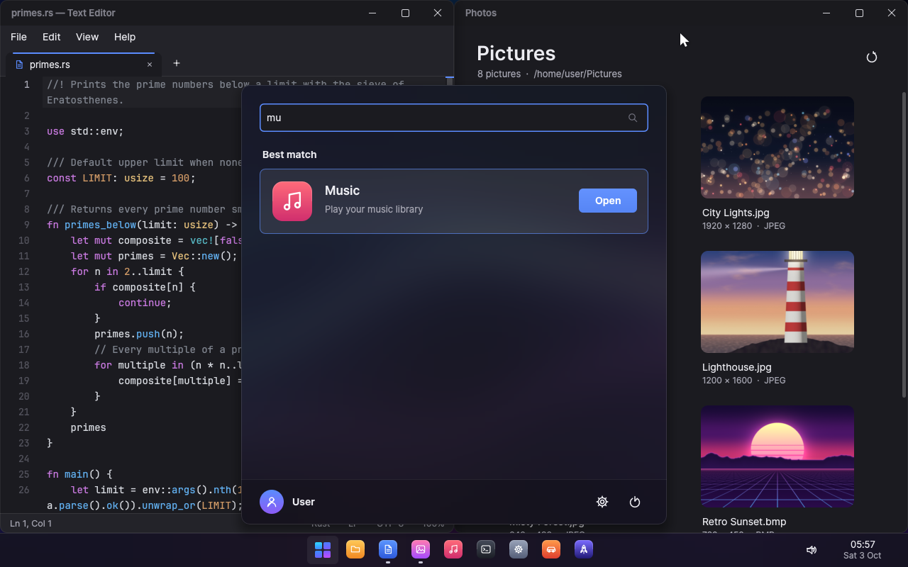
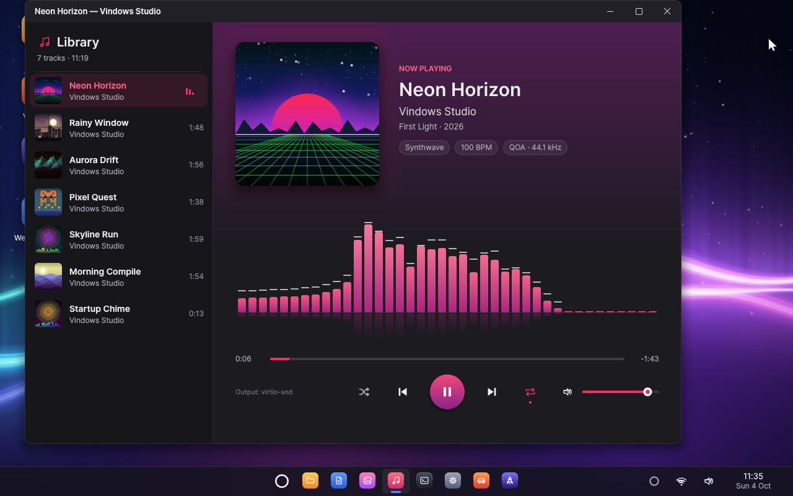
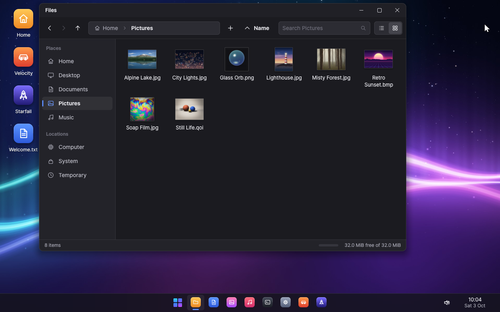
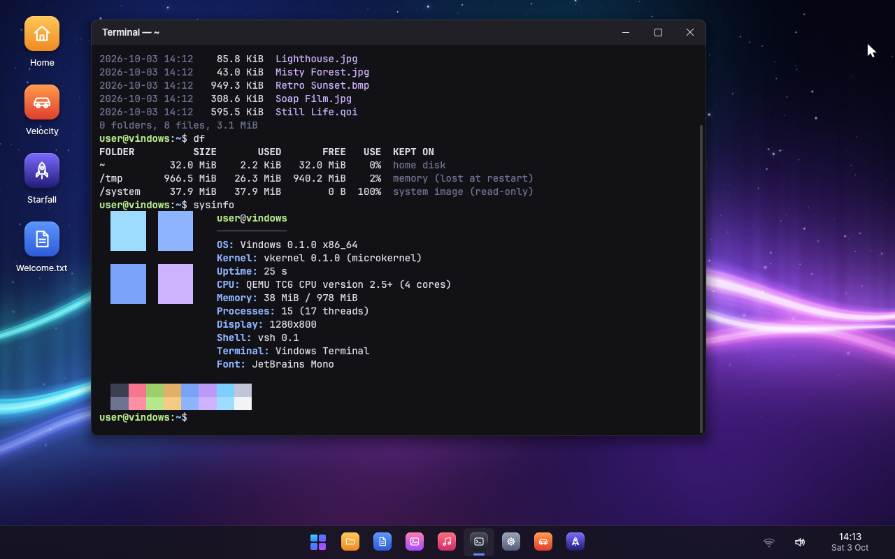
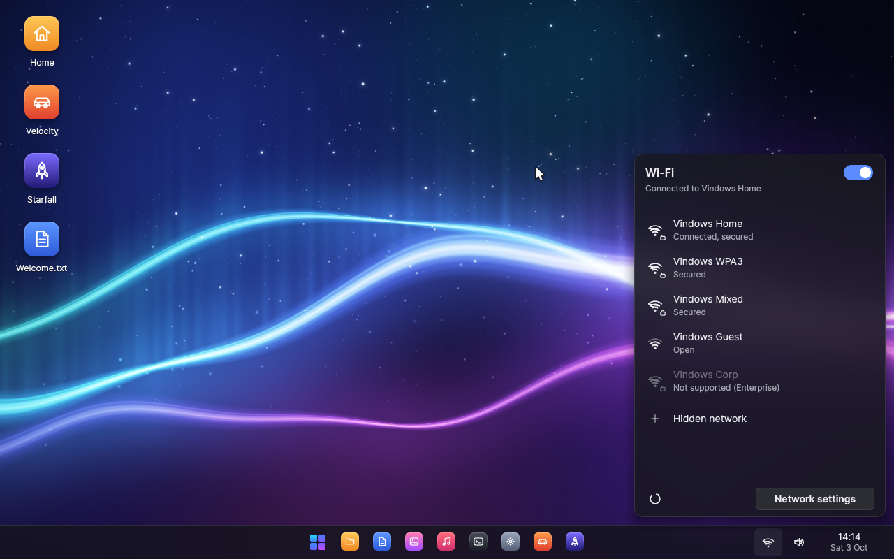
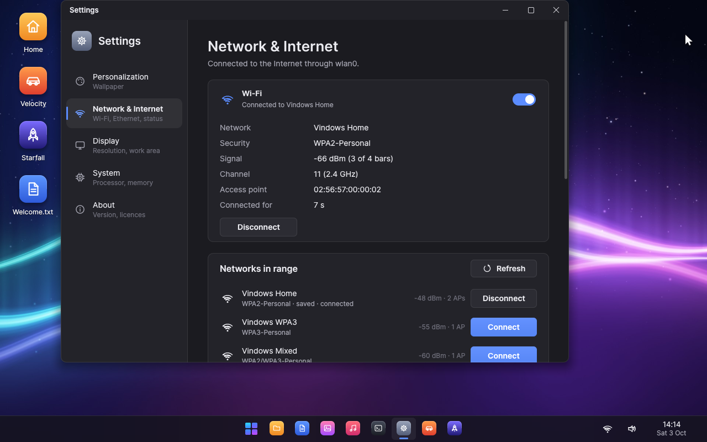
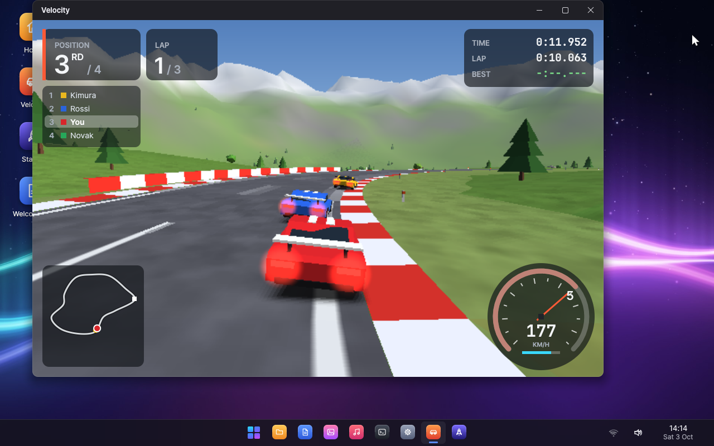
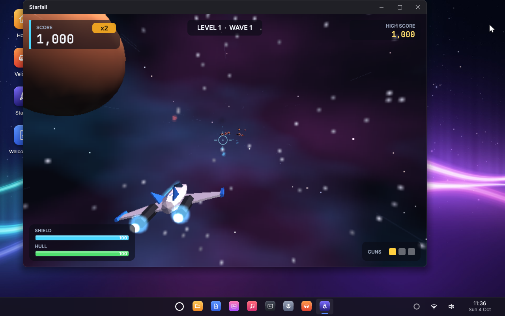

# Vindows

Vindows is a modern x86-64 operating system written from scratch,
entirely in Rust. It is built around a capability-based microkernel and
ships a polished graphical desktop and everyday applications, and reaches
the Internet over Ethernet and Wi-Fi. Everything — bootloader, kernel,
drivers, services, toolkit, applications — is in this repository; the
TCP/IP engine and the cryptographic primitives come from a few mature Rust
crates (smoltcp, RustCrypto).



## Highlights

* **Microkernel.** `vkernel` only does isolation, scheduling, memory and
  IPC: capability handles with rights, channels that carry handles, VMOs,
  events, futexes, interrupt objects. SMP with x2APIC, tickless timers and
  XSAVE. Drivers, the file system and the window system are user-space
  processes, supervised by `init`: if the window system crashes, it is
  restarted and the desktop comes back on its own.
* **Desktop.** A compositing window manager with server-side decorations,
  shadows, animations, window snapping and an Alt+Tab switcher with live
  thumbnails; a shell with wallpaper, desktop icons, a taskbar, a
  searchable start menu, a calendar and notifications;
  the `vui` toolkit (widgets, menus, dialogs, vector icons, anti-aliased
  text with the Inter and JetBrains Mono fonts).
* **Networking and Wi-Fi.** A user-space network service (IPv4 and IPv6,
  DHCP, DNS, routing, TCP, UDP, ICMP) and a Wi-Fi service that scans,
  joins WPA2, WPA3 and open networks with management frame protection,
  remembers networks, reconnects and roams on its own. Drivers only move
  frames. Under QEMU a simulated Wi-Fi environment provides access points
  bridged to the Internet. See [Networking](docs/NETWORKING.md).
* **Storage.** virtio-blk and AHCI (SATA) drivers and a file system
  service that keeps the home directory on its own disk with crash-safe
  snapshots, so your files survive restarts.
* **Applications.** Text Editor (tabs, syntax highlighting, find and
  replace, undo), Photos, Music, Files, Terminal, Task Manager, Settings
  and About.
* **3D games.** *Velocity*, a racing game, and *Starfall*, a space
  shooter, both rendered by the `v3d` software 3D engine.
* **Tooling.** One command builds a bootable disk image and runs it in
  QEMU; scripted, headless test runs drive the GUI and check screenshots
  and logs.

## Screenshots



|  |  |
|:---:|:---:|
| The start menu | Music |
|  |  |
| Files | Terminal |
|  |  |
| Wi-Fi networks | Settings: Network & Internet |
|  |  |
| *Velocity* | *Starfall* |

All screenshots are taken in QEMU by `cargo xtask script docs/screenshots.vts`.
Vindows also runs in VirtualBox (see below).

## Quick start

### Requirements

* Windows 10 or 11, x64. (User-space programs are PE executables linked by
  the Microsoft linker.)
* [Rust](https://rustup.rs) (stable). `rust-toolchain.toml` makes rustup
  install the extra `x86_64-unknown-uefi` target on first use.
* The Microsoft linker that Rust uses on Windows: Visual Studio 2022 or the
  Visual Studio Build Tools with the MSVC build tools (`link.exe`). The
  Rust installer offers to set these up.
* [QEMU](https://www.qemu.org/download/#windows) for Windows, which includes
  the OVMF UEFI firmware, and/or [VirtualBox](https://www.virtualbox.org/)
  7.1 or newer (no Extension Pack needed).

Check the environment:

```bash
cargo xtask doctor
```

### Build and run

```bash
cargo xtask run
```

This builds every component, writes the disk image
`target/vindows/vindows.img` and boots it in a QEMU window. The first build
takes one to two minutes on a recent PC (it also renders the sample pictures
and music); later builds are incremental. Useful options:

```bash
cargo xtask run --resolution 1920x1080 --smp 4 --memory 2048
cargo xtask run --cmdline "run=editor"
```

`--cmdline "run=NAME"` starts `/system/bin/NAME.exe` after boot. The
machine is on QEMU's NAT through a wired card by default; for Wi-Fi:

```bash
cargo xtask run --net wifi
```

This also starts `airsim`, a simulated Wi-Fi environment whose networks
("Vindows Home", "Vindows WPA3", ...; password `vindows-wifi`) lead to the
Internet. `--net both` adds the wired card. See `cargo xtask help` for all
commands and options.

### VirtualBox

Every command takes `--vm virtualbox` to use VirtualBox instead of QEMU,
with the same options:

```bash
cargo xtask run --vm virtualbox
```

xtask creates (and on every run updates) a VirtualBox machine named
"Vindows" whose disks are the same images QEMU uses, so builds need no
conversion and the home directory is shared between the two. VirtualBox
uses the CPU's hardware virtualization (QEMU on Windows emulates the CPU
in software). The machine is closer to a real
PC: SATA disks, an Intel PRO/1000 network card, PS/2 keyboard and mouse.
Click into the window to use the mouse; the right **Ctrl** key releases it.

On a high-DPI display the window enlarges the screen as QEMU's does, by the
whole part of the display scaling (2x at 250%), or less if the window
would not fit on the screen. `--scale` sets the factor (`--scale 2.5`
matches other programs at 250%; whole numbers look sharpest) and
`--resolution` gives Vindows a larger desktop:

```bash
cargo xtask run --vm virtualbox --resolution 1600x1000 --scale 2
```

To put Vindows on your real network (your router's DHCP and DNS, the real
Internet) through the host's network adapter, Wi-Fi included:

```bash
cargo xtask run --vm virtualbox --net bridged
```

`shot`, `script` and `test` work with `--vm virtualbox` too; scripts that
need QEMU (the simulated Wi-Fi) are skipped.

### Using the desktop

* Click the logo on the taskbar or tap the **Super** key for the start
  menu; type to search for an application.
* Click a taskbar button to open, focus or minimise an application;
  middle-click opens another window. Click the clock for the calendar.
* Double-click desktop icons. Right-click the desktop to change the
  wallpaper.
* Drag a window to the top of the screen to maximise it, or to a side to
  fill that half (or use **Super+Left/Right/Up/Down**). **Super+D** shows
  the desktop, **Alt+Tab** switches windows and **Alt+F4** closes the
  active one.
* The speaker icon on the taskbar opens the volume control (scroll over it
  to change the volume). The network icon next to it shows the Wi-Fi
  signal and opens the list of networks to join.

Your files live in `/home/user`, kept on `target/vindows/home.img` across
restarts and rebuilds (`--fresh-home` starts over).

## Applications

| Application | What it does |
|-------------|--------------|
| **Text Editor** | Tabs, syntax highlighting (Rust, C, TOML, Markdown), find and replace, word wrap, line numbers, zoom, unlimited undo, open/save dialogs. |
| **Photos** | A thumbnail library of `~/Pictures` and a viewer with zoom, pan, rotation, full screen, details and "set as wallpaper"; PNG, JPEG (including progressive), BMP and QOI. |
| **Music** | A library of `~/Music`, now playing with cover art and a live spectrum visualiser, seeking, shuffle and repeat; plays QOA and WAV through the audio service. |
| **Files** | Places sidebar, breadcrumbs, list and icon views with thumbnails, search, copy/cut/paste, rename, delete, new folders and documents, properties, free space. |
| **Terminal** | A command shell with about fifty built-in commands for files, processes, the network (`wifi`, `ifconfig`, `ping`, `nslookup`, `curl`, ...) and the system, history and tab completion. |
| **Task Manager** | Processes with CPU and memory use, "end task", and live performance graphs. |
| **Settings** | Wallpaper gallery, network and Wi-Fi (connection, networks in range, saved networks, interfaces, diagnostics), display information and system details. |
| **Velocity** | An arcade 3D racing game against computer opponents on a procedurally generated circuit. |
| **Starfall** | A 3D space shooter through asteroid fields and enemy waves. |

The games are drawn by `v3d`, a multi-threaded fixed-point software 3D
renderer; there is no GPU.

## Testing

```bash
cargo xtask test
```

runs the host unit tests of the libraries (kernel ABI, heap, IPC, service
protocols, math, rasterizer, fonts, image codecs, 2D graphics, text editing,
paths and file types, audio, build tool) and then boots Vindows headless with the `systest`
integration tests (IPC, threads, file system, launcher, crash reports and
recovery of the window system after it is killed), failing on any panic.

Networking has its own host tests (the 802.11 protocol and cryptography
against published test vectors, station against access point, TCP/IP stacks
over a simulated cable, the Wi-Fi simulator), and `nettest` checks DNS,
TCP, HTTP and ping from inside Vindows.

GUI automation scripts in `tests/ui/` click through the desktop and
applications, check the log and save screenshots. The Wi-Fi scripts join
networks through the desktop and break the simulated network in many ways
(access point gone, disconnection, outages, the radio or the Wi-Fi service
vanishing) to check that Vindows recovers by itself. Run them all with the
unit and integration tests, or one at a time:

```bash
cargo xtask test --ui
```

```bash
cargo xtask script tests/ui/editor.vts
```

```bash
cargo xtask shot --wait 20
```

(`shot` boots headless and saves `target/vindows/screen.png`.)

The serial console (kernel log plus every program's output) is saved to
`target/vindows/serial.log`.

## Repository layout

| Path | Contents |
|------|----------|
| `boot/` | `vboot`, the UEFI bootloader |
| `kernel/` | `vkernel`, the microkernel |
| `lib/` | shared libraries: `abi` (system call ABI), `rt` (runtime), `ipc` (message codec and protocol macros), `proto` (service protocols), `gfx`/`raster`/`font`/`image` (2D graphics), `ui` (toolkit), `v3d` (3D engine), `audio`, `text`, `math`, ... |
| `services/` | `init` (service registry, launcher), `vfs`, `devmgr` (PCI), `compositor`, `audio`, `netd` (network), `wlan` (Wi-Fi) |
| `drivers/` | `ps2`, `virtio-input`, `virtio-blk`, `ahci` (SATA), `virtio-snd`, `virtio-net`, `e1000` (Intel PRO/1000), `vwifi` (the virtual Wi-Fi radio) |
| `apps/` | the desktop `shell` and the applications, including `racer` (*Velocity*) and `starfall` |
| `tests/` | `systest` and `nettest` (in-system tests) and GUI automation scripts |
| `tools/` | host programs generating wallpapers, sample pictures and music at build time, and `airsim` (the simulated Wi-Fi environment) |
| `third_party/` | vendored crates with Vindows patches (smoltcp) |
| `xtask/` | the build system: cross-compilation, disk image, QEMU, automation |
| `assets/` | fonts, application manifests, sample documents |

## Documentation

* [Architecture](docs/ARCHITECTURE.md): how the system fits together.
* [Networking](docs/NETWORKING.md): the network and Wi-Fi services, the
  simulated Wi-Fi environment, security and tests.
* [Developing](docs/DEVELOPING.md): build commands, the system image,
  writing applications, performance notes.
* [Coding conventions](docs/CODING.md).

## License

Vindows is released under the MIT license. The bundled fonts (Inter, Lato,
JetBrains Mono) are under the SIL Open Font License 1.1; see
`assets/fonts/`.
